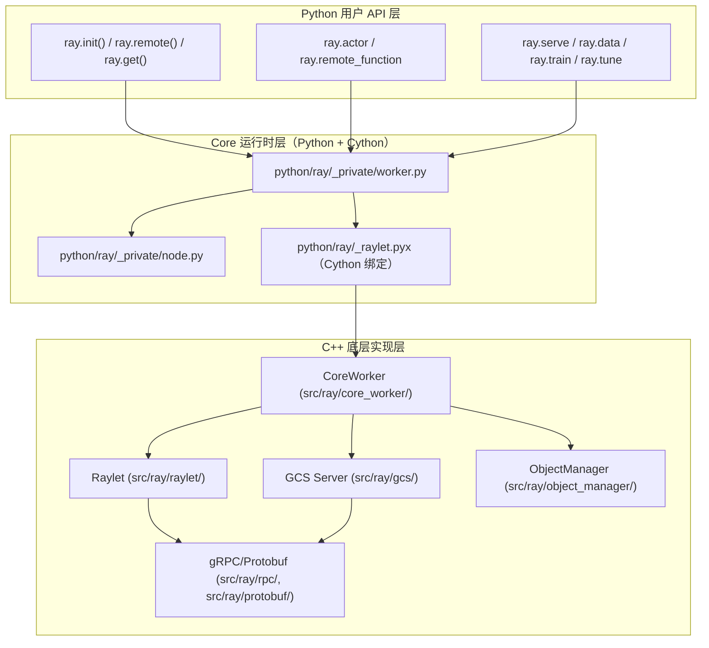
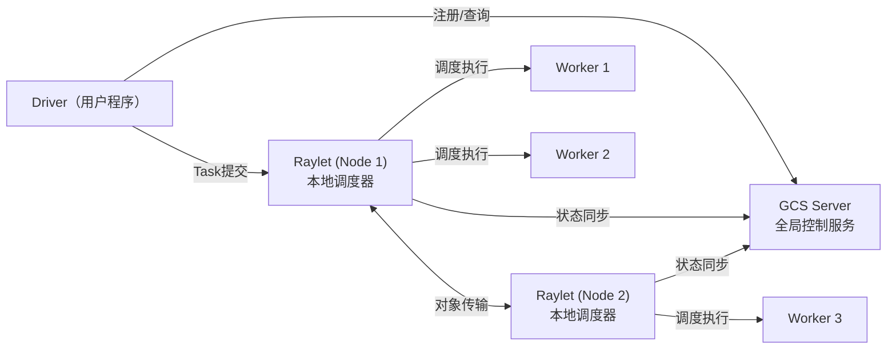
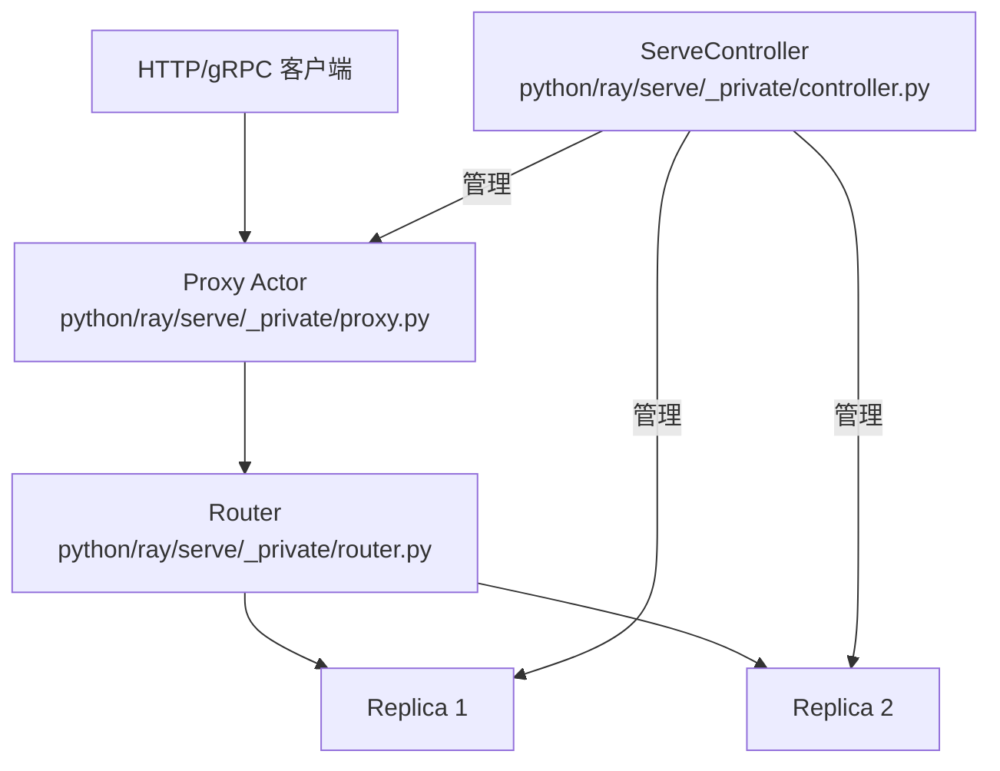

# Ray 代码逻辑走读学习指南

> 本文档基于 Ray 源码，系统梳理了 Ray 项目的核心架构和代码走读路径，帮助开发者从宏观到微观地理解 Ray 的设计与实现。

---

## 目录

- [1. 项目总体架构概览](#1-项目总体架构概览)
- [2. Ray Core 运行时走读路径](#2-ray-core-运行时走读路径)
  - [2.1 ray.init() 初始化流程](#21-rayinit-初始化流程)
  - [2.2 Task 提交与执行](#22-task-提交与执行)
  - [2.3 Actor 机制](#23-actor-机制)
  - [2.4 对象存储与传输](#24-对象存储与传输)
- [3. C++ 底层组件走读路径](#3-c-底层组件走读路径)
  - [3.1 GCS Server](#31-gcs-server)
  - [3.2 Raylet](#32-raylet)
  - [3.3 CoreWorker](#33-coreworker)
  - [3.4 gRPC 通信层](#34-grpc-通信层)
  - [3.5 ObjectManager](#35-objectmanager)
- [4. AI 生态库走读路径](#4-ai-生态库走读路径)
  - [4.1 Ray Serve](#41-ray-serve)
  - [4.2 Ray Data](#42-ray-data)
  - [4.3 Ray Train](#43-ray-train)
  - [4.4 Ray Tune](#44-ray-tune)
  - [4.5 RLlib](#45-rllib)
- [5. DAG 与 Compiled Graph](#5-dag-与-compiled-graph)
  - [5.1 DAG API](#51-dag-api)
  - [5.2 Compiled Graph（加速 DAG）](#52-compiled-graph加速-dag)
- [6. 辅助系统走读路径](#6-辅助系统走读路径)
  - [6.1 Dashboard](#61-dashboard)
  - [6.2 Autoscaler](#62-autoscaler)
  - [6.3 Runtime Env](#63-runtime-env)
- [7. 分阶段学习路线图与最佳实践](#7-分阶段学习路线图与最佳实践)

---

## 1. 项目总体架构概览

### 1.1 三层架构

Ray 项目采用经典的三层分层设计：



### 1.2 核心组件关系



### 1.3 关键目录结构

| 目录 | 职责 |
|------|------|
| `python/ray/` | Python API 与运行时层 |
| `python/ray/_private/` | 内部实现（worker、node、服务管理等） |
| `python/ray/_raylet.pyx` | Cython 绑定层（Python ↔ C++ 桥梁），~198KB 大文件 |
| `src/ray/core_worker/` | C++ CoreWorker 实现（Task 提交、对象管理、Actor 管理） |
| `src/ray/gcs/` | GCS Server（全局控制服务） |
| `src/ray/raylet/` | Raylet（本地调度器、Worker Pool 管理） |
| `src/ray/object_manager/` | 跨节点对象传输 |
| `src/ray/rpc/` | gRPC 通信框架 |
| `src/ray/protobuf/` | Protobuf 消息定义 |
| `src/ray/common/scheduling/` | 调度策略 |
| `python/ray/serve/` | Ray Serve（模型服务） |
| `python/ray/data/` | Ray Data（数据处理） |
| `python/ray/train/` | Ray Train（分布式训练） |
| `python/ray/tune/` | Ray Tune（超参调优） |
| `rllib/` | RLlib（强化学习库） |
| `python/ray/dag/` | DAG 执行引擎 |
| `python/ray/dashboard/` | Dashboard 服务 |
| `python/ray/autoscaler/` | 自动伸缩 |
| `python/ray/runtime_env/` | 运行时环境 |

---

## 2. Ray Core 运行时走读路径

### 2.1 `ray.init()` 初始化流程

**调用链全貌：**

```
ray.init()
  └─> python/ray/_private/worker.py :: init()
        ├─> 解析地址参数（address / bootstrap_address）
        ├─> 创建或连接集群
        │     ├─> [新集群] python/ray/_private/node.py :: Node.__init__()
        │     │     ├─> 启动 GCS Server 进程
        │     │     ├─> 启动 Raylet 进程
        │     │     ├─> 启动 Dashboard 进程
        │     │     └─> 启动其他辅助服务
        │     └─> [已有集群] 直接连接到 GCS 地址
        ├─> python/ray/_raylet.pyx :: CoreWorkerProcess.Initialize()
        │     └─> C++ CoreWorkerProcess::Initialize(options)
        │           └─> CoreWorkerProcessImpl 构造
        │                 ├─> 初始化 IO 线程
        │                 ├─> 创建 CoreWorker 实例
        │                 ├─> 连接 GCS Client
        │                 ├─> 连接 Raylet
        │                 └─> 启动 gRPC Server
        └─> 返回 RayContext
```

**走读关键文件：**

| 步骤 | 文件 | 关键函数/类 |
|------|------|------------|
| 1. 入口 | `python/ray/__init__.py` | `ray.init` (导出) |
| 2. 初始化逻辑 | `python/ray/_private/worker.py` | `init()` 函数（~300 行） |
| 3. 节点启动 | `python/ray/_private/node.py` | `Node.__init__()` |
| 4. Cython 绑定 | `python/ray/_raylet.pyx` | `CoreWorkerProcess` |
| 5. C++ 初始化 | `src/ray/core_worker/core_worker_process.cc` | `CoreWorkerProcess::Initialize()` |
| 6. C++ Worker | `src/ray/core_worker/core_worker.cc` | `CoreWorker` 构造函数 |

**Head Node vs Worker Node 差异：**

- **Head Node**：启动 GCS Server + Raylet + Dashboard + 各种辅助服务
- **Worker Node**：只启动 Raylet，连接到 Head Node 的 GCS Server

---

### 2.2 Task 提交与执行

#### 2.2.1 `@ray.remote` 装饰器

```
@ray.remote
  └─> python/ray/_private/worker.py :: remote()
        └─> _make_remote(function_or_class, options)
              ├─> [函数] → RemoteFunction(Language.PYTHON, func, None, options)
              └─> [类]   → ray.actor._make_actor(cls, options)
```

**走读关键文件：**

| 文件 | 关键类/函数 |
|------|------------|
| `python/ray/_private/worker.py` | `remote()`, `_make_remote()` |
| `python/ray/remote_function.py` | `RemoteFunction` 类，`_remote()` 方法 |
| `python/ray/_private/ray_option_utils.py` | 参数校验 |

#### 2.2.2 Task 提交（`.remote()` 调用）

```
f.remote(args)
  └─> RemoteFunction._remote(args, kwargs, **options)
        └─> worker.core_worker.submit_task(...)  # Cython 调用
              └─> C++ CoreWorker::SubmitTask()
                    └─> NormalTaskSubmitter::SubmitTask()
                          ├─> 序列化任务规格（TaskSpec）
                          ├─> 请求 Raylet 分配 Worker（lease request）
                          └─> 将 Task 发送给 Worker 执行
```

#### 2.2.3 `ray.get()` 对象获取

```
ray.get(object_ref)
  └─> python/ray/_private/worker.py :: get()
        └─> worker.core_worker.get_objects([object_ref])
              └─> C++ CoreWorker::Get()
                    ├─> 本地 MemoryStore 查找
                    ├─> [未找到] PlasmaStoreProvider 查找
                    └─> [远程对象] ObjectManager Fetch
```

#### 2.2.4 Raylet 端调度流程

```
Raylet 收到 lease request
  └─> src/ray/raylet/node_manager.cc :: HandleRequestWorkerLease()
        ├─> 调度策略（src/ray/common/scheduling/）
        │     ├─> HybridScheduler（默认）
        │     ├─> SpreadScheduler
        │     └─> NodeAffinityScheduler
        ├─> Worker Pool 分配 Worker
        └─> Worker 执行 Task → 结果存入 ObjectStore
```

---

### 2.3 Actor 机制

#### 2.3.1 Actor 创建流程

```
ActorClass.remote()
  └─> python/ray/actor.py :: ActorClass._remote()
        └─> worker.core_worker.create_actor(...)  # Cython
              └─> C++ CoreWorker::CreateActor()
                    └─> GCS Server 注册 Actor
                          └─> GcsActorManager::RegisterActor()
                                ├─> 选择节点
                                ├─> Raylet 启动 Actor Worker
                                └─> Actor Worker 初始化 Actor 实例
```

**走读关键文件：**

| 文件 | 关键类/函数 |
|------|------------|
| `python/ray/actor.py` | `ActorClass`, `_ray_from_modified_class()`, `_remote()`, `ActorHandle` |
| `python/ray/_raylet.pyx` | `_actor_method_call()` |
| `src/ray/gcs/gcs_server/gcs_actor_manager.cc` | `GcsActorManager` |

#### 2.3.2 Actor 方法调用

```
actor.method.remote(args)
  └─> ActorHandle._actor_method_call()
        └─> worker.core_worker.submit_actor_task(...)
              └─> C++ ActorTaskSubmitter::SubmitTask()
                    └─> 直接发送给 Actor Worker（无需调度）
```

#### 2.3.3 Actor 生命周期

- **状态机**：`PENDING_CREATION` → `ALIVE` → `RESTARTING` → `DEAD`
- **重启策略**：`max_restarts` 参数控制最大重启次数（`-1` 表示无限重启）
- **参考设计文档**：`src/ray/design_docs/actor_states.rst`

---

### 2.4 对象存储与传输

#### 2.4.1 `ray.put()` 存储流程

```
ray.put(value)
  └─> Python 序列化（pickle / Arrow）
        └─> _raylet.pyx :: CoreWorker.put()
              └─> C++ CoreWorker::Put()
                    ├─> 小对象 → CoreWorkerMemoryStore（进程内存储）
                    └─> 大对象 → PlasmaStore（共享内存）
```

#### 2.4.2 `ray.get()` 获取流程

```
ray.get(ref)
  └─> C++ CoreWorker::Get()
        ├─> MemoryStore 查找（零拷贝）
        ├─> PlasmaStore 查找（共享内存读取）
        └─> [远程对象] ObjectManager::Pull()
              └─> 跨节点传输 → 写入本地 PlasmaStore
```

#### 2.4.3 对象溢出（Spilling）

当 ObjectStore 内存不足时，对象溢出到外部存储：

| 文件 | 职责 |
|------|------|
| `python/ray/_private/external_storage.py` | 外部存储抽象接口 |
| `src/ray/core_worker/store_provider/` | 存储提供者实现 |

---

## 3. C++ 底层组件走读路径

### 3.1 GCS Server

GCS（Global Control Service）是 Ray 集群的全局控制服务，管理集群元数据。

**入口与启动流程：**

```
src/ray/gcs/gcs_server_main.cc :: main()
  └─> GcsServer 构造 + Start()
        └─> DoStart(gcs_init_data)
              ├─> InitClusterResourceScheduler()
              ├─> InitGcsNodeManager()
              ├─> InitGcsResourceManager()
              ├─> InitGcsJobManager()
              ├─> InitGcsActorManager()
              ├─> InitGcsWorkerManager()
              ├─> InitGcsPlacementGroupManager()
              ├─> InitGcsTaskManager()
              ├─> InitGcsAutoscalerStateManager()
              ├─> InitKVService()
              ├─> InitPubSubHandler()
              ├─> InitRuntimeEnvManager()
              └─> rpc_server_.Run()
```

**核心管理器职责：**

| 管理器 | 文件 | 职责 |
|--------|------|------|
| `GcsNodeManager` | `gcs_node_manager.cc/h` | 集群节点注册、心跳、故障检测 |
| `GcsActorManager` | `gcs_actor_manager.cc/h` | Actor 创建、调度、生命周期 |
| `GcsResourceManager` | `gcs_resource_manager.cc/h` | 全局资源视图维护 |
| `GcsPlacementGroupManager` | `gcs_placement_group_manager.cc/h` | Placement Group 管理 |
| `GcsJobManager` | `gcs_job_manager.cc/h` | Job 注册、状态跟踪 |
| `GcsWorkerManager` | `gcs_worker_manager.cc/h` | Worker 注册、监控 |
| `GcsTaskManager` | `gcs_task_manager.cc/h` | Task 事件收集与查询 |

**GCS 存储层：**

```
src/ray/gcs/store_client/
  ├─> store_client.h          # KV 存储抽象接口
  ├─> in_memory_store_client   # 内存存储后端
  └─> redis_store_client       # Redis 持久化后端
```

---

### 3.2 Raylet

Raylet 是运行在每个节点上的本地调度器和资源管理器。

**走读路径：**

```
src/ray/raylet/main.cc
  └─> Raylet 构造
        └─> NodeManager（核心）
              ├─> Worker Pool 管理
              │     └─> src/ray/raylet/worker_pool.cc
              ├─> 本地调度
              │     └─> HandleRequestWorkerLease()
              ├─> 资源管理
              │     └─> ClusterResourceScheduler
              └─> 对象管理（与 ObjectManager 协作）
```

**调度策略模块：**

| 文件 | 调度策略 |
|------|---------|
| `src/ray/common/scheduling/scheduling_policy.cc` | 调度策略基础框架 |
| `src/ray/common/scheduling/hybrid_scheduling_policy.cc` | 混合调度（默认） |
| `src/ray/common/scheduling/spread_scheduling_policy.cc` | 扩散调度 |
| `src/ray/common/scheduling/node_label_scheduling_policy.cc` | 基于标签的调度 |

---

### 3.3 CoreWorker

CoreWorker 是 Ray 运行时的核心，运行在 Driver 和 Worker 进程中。

> ⚠️ `core_worker.cc` 是约 195KB 的大文件，建议分模块阅读。

**走读路径：**

```
src/ray/core_worker/
  ├─> core_worker_process.cc/h    # 进程级生命周期管理
  ├─> core_worker.cc/h            # 核心实现（~195KB）
  ├─> task_manager.cc/h           # Task 生命周期管理（提交、重试、完成）
  ├─> reference_counter.cc/h      # 对象引用计数与 GC
  ├─> task_submission/             # Task 提交策略
  │     ├─> normal_task_submitter  # 普通 Task 提交
  │     └─> actor_task_submitter   # Actor Task 提交
  ├─> store_provider/              # 对象存储提供者
  │     ├─> memory_store           # 进程内内存存储
  │     └─> plasma_store_provider  # Plasma 共享内存
  └─> transport/                   # 数据传输
```

**CoreWorker 核心职责分解：**

| 模块 | 职责 |
|------|------|
| Task 提交 | `SubmitTask()`, `SubmitActorTask()` |
| 对象管理 | `Put()`, `Get()`, `Delete()` |
| Actor 管理 | `CreateActor()`, `RemoveActorHandleReference()` |
| 引用计数 | `AddLocalReference()`, `RemoveLocalReference()` |
| RPC 服务 | 处理来自其他组件的远程调用 |

---

### 3.4 gRPC 通信层

Ray 内部所有组件通信基于 gRPC：

```
src/ray/protobuf/
  ├─> common.proto         # 通用消息定义（TaskSpec, ActorHandle 等）
  ├─> gcs.proto            # GCS 服务接口
  ├─> gcs_service.proto    # GCS gRPC 服务定义
  ├─> node_manager.proto   # Raylet 服务接口
  └─> core_worker.proto    # CoreWorker 服务接口

src/ray/rpc/
  ├─> grpc_server.cc/h          # gRPC Server 基础框架
  ├─> grpc_client.cc/h          # gRPC Client 基础框架
  ├─> gcs_server/                # GCS Server RPC 实现
  ├─> node_manager/              # Raylet RPC 实现
  └─> core_worker_client_pool.h  # CoreWorker 客户端连接池
```

---

### 3.5 ObjectManager

ObjectManager 负责跨节点的对象传输：

```
src/ray/object_manager/
  ├─> object_manager.cc/h     # 主入口
  ├─> pull_manager.cc/h       # 拉取管理器（按需获取远程对象）
  ├─> push_manager.cc/h       # 推送管理器（主动推送对象）
  ├─> object_buffer_pool.cc/h # 对象缓冲池
  └─> chunk_object_reader/writer # 分块传输
```

---

## 4. AI 生态库走读路径

### 4.1 Ray Serve

Ray Serve 是 Ray 的模型服务框架。

**架构概览：**



**走读关键文件：**

| 文件 | 职责 |
|------|------|
| `python/ray/serve/api.py` | 用户面 API（`serve.run()`, `@serve.deployment`） |
| `python/ray/serve/handle.py` | `DeploymentHandle`（编程调用入口） |
| `python/ray/serve/_private/api.py` | 内部 API，启动 Controller |
| `python/ray/serve/_private/controller.py` | `ServeController`（集中管理 Actor） |
| `python/ray/serve/_private/application_state.py` | 应用状态管理 |
| `python/ray/serve/_private/deployment_scheduler.py` | Deployment 调度器 |
| `python/ray/serve/_private/replica.py` | Replica 实现（执行推理逻辑） |
| `python/ray/serve/_private/proxy.py` | HTTP/gRPC Proxy Actor |
| `python/ray/serve/_private/router.py` | 请求路由（负载均衡） |
| `python/ray/serve/_private/default_impl.py` | Controller/Proxy 的 Actor 创建入口 |

---

### 4.2 Ray Data

Ray Data 是 Ray 的分布式数据处理引擎。

**处理流水线：**

```
Dataset API → LogicalPlan → [优化] → PhysicalPlan → [优化] → StreamingExecutor 执行
```

**走读关键文件：**

| 文件 | 职责 |
|------|------|
| `python/ray/data/read_api.py` | 数据读取 API（`ray.data.read_parquet()` 等） |
| `python/ray/data/dataset.py` | `Dataset` 类（核心用户 API） |
| `python/ray/data/_internal/logical/interfaces.py` | `LogicalOperator`, `LogicalPlan` 接口 |
| `python/ray/data/_internal/logical/operators/` | 各逻辑算子（MapBatches, Filter, Sort 等） |
| `python/ray/data/_internal/logical/optimizers.py` | 逻辑/物理计划优化器 |
| `python/ray/data/_internal/planner/planner.py` | Planner（逻辑计划 → 物理计划） |
| `python/ray/data/_internal/execution/interfaces.py` | `PhysicalOperator`, `Executor` 接口 |
| `python/ray/data/_internal/execution/streaming_executor.py` | `StreamingExecutor`（流式执行器） |
| `python/ray/data/_internal/execution/streaming_executor_state.py` | 执行状态管理 |
| `python/ray/data/_internal/plan.py` | `ExecutionPlan`（连接 Dataset 与 Executor） |

---

### 4.3 Ray Train

Ray Train 是 Ray 的分布式训练框架。

**走读关键文件：**

| 文件 | 职责 |
|------|------|
| `python/ray/train/trainer.py` | `BaseTraineR` 抽象类 |
| `python/ray/train/data_parallel_trainer.py` | `DataParallelTrainer`（数据并行训练基类） |
| `python/ray/train/torch/torch_trainer.py` | `TorchTrainer`（PyTorch 训练器） |
| `python/ray/train/_internal/backend_executor.py` | `BackendExecutor`（Worker 编排与执行） |
| `python/ray/train/_internal/session.py` | `Session`（训练会话，checkpoint 与 metrics 上报） |
| `python/ray/train/_internal/storage.py` | 存储管理（本地/远程 checkpoint） |
| `python/ray/train/_internal/worker_group.py` | `WorkerGroup`（训练 Worker 组管理） |

**训练流程概览：**

```
Trainer.fit()
  └─> DataParallelTrainer._validate()
        └─> BackendExecutor.start()
              ├─> 创建 WorkerGroup（一组 Ray Actor）
              ├─> 设置分布式环境（torch.distributed 等）
              └─> 执行训练函数
                    └─> Session.report()（上报 metrics + checkpoint）
```

---

### 4.4 Ray Tune

Ray Tune 是 Ray 的超参数调优框架。

**走读关键文件：**

| 文件 | 职责 |
|------|------|
| `python/ray/tune/tuner.py` | `Tuner`（用户面入口） |
| `python/ray/tune/execution/tune_controller.py` | `TuneController`（调优核心控制器） |
| `python/ray/tune/experiment/trial.py` | `Trial`（单次试验） |
| `python/ray/tune/search/searcher.py` | `Searcher`（搜索算法基类） |
| `python/ray/tune/search/bayesopt.py` | 贝叶斯优化搜索 |
| `python/ray/tune/schedulers/async_hyperband.py` | `ASHAScheduler`（异步 HyperBand） |
| `python/ray/tune/schedulers/pbt.py` | `PopulationBasedTraining` |

**调优流程概览：**

```
Tuner.fit()
  └─> TuneController.run()
        ├─> Searcher.suggest()    → 生成超参配置
        ├─> 创建 Trial            → 启动训练 Actor
        ├─> Trial 执行            → 训练 + 上报结果
        ├─> Scheduler.on_trial_result() → 决定 Trial 继续/停止/修改
        └─> 循环直到完成所有 Trial
```

---

### 4.5 RLlib

RLlib 是 Ray 的强化学习库。

**走读关键文件：**

| 文件 | 职责 |
|------|------|
| `rllib/algorithms/algorithm.py` | `Algorithm`（算法基类，训练循环入口） |
| `rllib/algorithms/algorithm_config.py` | `AlgorithmConfig`（配置构建器） |
| `rllib/core/learner/learner.py` | `Learner`（参数更新） |
| `rllib/env/single_agent_env_runner.py` | `SingleAgentEnvRunner`（环境交互采样） |
| `rllib/core/rl_module/rl_module.py` | `RLModule`（策略网络模块） |
| `rllib/connectors/connector_v2.py` | `ConnectorV2`（数据预处理管道） |
| `rllib/env/single_agent_episode.py` | `SingleAgentEpisode`（回合数据） |

**训练循环概览：**

```
Algorithm.train()
  ├─> EnvRunner.sample()          # 采样（环境交互 + 数据收集）
  │     ├─> RLModule.forward()    # 策略前向推理
  │     └─> ConnectorV2.transform()  # 数据预/后处理
  ├─> Learner.update()            # 参数更新
  │     └─> RLModule.forward()    # 训练前向 + 反向传播
  └─> 同步参数到 EnvRunner
```

---

## 5. DAG 与 Compiled Graph

### 5.1 DAG API

DAG API 允许用户构建静态计算图，延迟执行。

**走读关键文件：**

| 文件 | 职责 |
|------|------|
| `python/ray/dag/dag_node.py` | `DAGNode`（所有 DAG 节点的基类） |
| `python/ray/dag/input_node.py` | `InputNode`（DAG 输入节点） |
| `python/ray/dag/function_node.py` | `FunctionNode`（远程函数节点） |
| `python/ray/dag/class_node.py` | `ClassMethodNode`（Actor 方法节点） |
| `python/ray/dag/output_node.py` | `MultiOutputNode`（多输出节点） |

**DAG 构建示例：**

```python
with InputNode() as inp:
    result = actor.method.bind(inp)  # 创建 ClassMethodNode
    dag = result

compiled_dag = dag.experimental_compile()  # 编译为加速图
ref = compiled_dag.execute(data)           # 执行
result = ray.get(ref)                      # 获取结果
```

---

### 5.2 Compiled Graph（加速 DAG）

Compiled Graph 是 Ray 的实验性加速执行引擎，通过预编译 DAG 减少调度开销。

> ⚠️ `compiled_dag_node.py` 是约 140KB 的大文件，建议分模块阅读。

**走读关键文件：**

| 文件 | 职责 |
|------|------|
| `python/ray/dag/compiled_dag_node.py` | `CompiledDAG` 类（编译、执行、可视化） |
| `python/ray/dag/dag_node_operation.py` | 操作定义 |
| `python/ray/dag/constants.py` | 配置常量 |

**编译流程：**

```
dag.experimental_compile()
  └─> build_compiled_dag_from_ray_dag()
        ├─> 遍历 DAG 拓扑，构建 idx_to_task 映射
        ├─> 验证 DAG 有效性（每个 Task 必须有 DAGNode 输入）
        ├─> 死锁检测（可选）
        ├─> 创建通信 Channel（共享内存 / NCCL）
        └─> 编译执行计划
```

**执行流程：**

```
compiled_dag.execute(args)
  ├─> 检查输入参数
  ├─> 检查 inflight execution 数量限制
  ├─> 写入 dag_input_channels
  └─> 返回 CompiledDAGRef
        └─> ray.get(ref) → 从 output_channels 读取结果
```

---

## 6. 辅助系统走读路径

### 6.1 Dashboard

**走读关键文件：**

| 文件 | 职责 |
|------|------|
| `python/ray/dashboard/dashboard.py` | Dashboard 主进程入口 |
| `python/ray/dashboard/head.py` | Head 模块（运行在 Head Node） |
| `python/ray/dashboard/agent.py` | Agent 模块（运行在每个 Node） |
| `python/ray/dashboard/modules/` | 各功能模块（job、actor、node 等） |
| `python/ray/dashboard/client/` | 前端 React 应用 |

---

### 6.2 Autoscaler

**走读关键文件：**

| 文件/目录 | 职责 |
|----------|------|
| `python/ray/autoscaler/` | Autoscaler 入口 |
| `python/ray/autoscaler/_private/` | 核心实现（资源需求计算、节点启停） |
| `python/ray/autoscaler/v2/` | V2 版本（基于 GCS 的新架构） |
| `python/ray/autoscaler/aws/` | AWS 云适配 |
| `python/ray/autoscaler/gcp/` | GCP 云适配 |
| `python/ray/autoscaler/azure/` | Azure 云适配 |
| `python/ray/autoscaler/kuberay/` | KubeRay（Kubernetes）适配 |

---

### 6.3 Runtime Env

**走读关键文件：**

| 文件/目录 | 职责 |
|----------|------|
| `python/ray/runtime_env/runtime_env.py` | `RuntimeEnv` 用户 API |
| `python/ray/runtime_env/` | 环境插件体系（pip、conda、container 等） |
| `python/ray/_private/runtime_env/` | 内部实现 |
| `python/ray/_private/runtime_env/agent/` | RuntimeEnv Agent（每节点环境管理） |

**环境创建流程：**

```
ray.init(runtime_env={...})  或  @ray.remote(runtime_env={...})
  └─> RuntimeEnv 序列化 → GCS 存储
        └─> Worker 启动前 → RuntimeEnv Agent 创建环境
              ├─> 安装 pip/conda 依赖
              ├─> 下载 working_dir
              ├─> 设置环境变量
              └─> Worker 在隔离环境中启动
```

---

## 7. 分阶段学习路线图与最佳实践

### 7.1 三阶段学习路线

```mermaid
graph LR
    subgraph "🟢 入门阶段（1-2 周）"
        P1["理解 ray.init() 流程"]
        P2["理解 @ray.remote 与 .remote() 调用"]
        P3["理解 ray.get() / ray.put()"]
        P4["理解 Actor 基本使用"]
    end

    subgraph "🟡 进阶阶段（2-4 周）"
        M1["Actor 生命周期与重启"]
        M2["对象存储与传输机制"]
        M3["DAG API 与 Compiled Graph"]
        M4["Ray Serve / Data 等生态库"]
    end

    subgraph "🔴 深入阶段（4+ 周）"
        A1["C++ CoreWorker 源码"]
        A2["GCS Server 源码"]
        A3["Raylet 调度策略"]
        A4["gRPC 通信与 Protobuf"]
        A5["ObjectManager 对象传输"]
    end

    P1 --> P2 --> P3 --> P4
    P4 --> M1 --> M2 --> M3 --> M4
    M4 --> A1 --> A2 --> A3 --> A4 --> A5
```



**入门阶段推荐走读顺序：**

1. `python/ray/__init__.py` → 了解 Ray 对外暴露的 API
2. `python/ray/_private/worker.py` → `init()` 和 `remote()` 的实现
3. `python/ray/remote_function.py` → `RemoteFunction` 类
4. `python/ray/actor.py` → `ActorClass` 和 `ActorHandle`

**进阶阶段推荐走读顺序：**

1. `python/ray/_raylet.pyx` → Cython 绑定层（分模块阅读）
2. `python/ray/dag/` → DAG API 全貌
3. `python/ray/serve/_private/controller.py` → Serve 核心
4. `python/ray/data/_internal/execution/streaming_executor.py` → Data 执行引擎

**深入阶段推荐走读顺序：**

1. `src/ray/core_worker/core_worker_process.cc` → CoreWorker 生命周期
2. `src/ray/core_worker/core_worker.cc` → 核心逻辑（分模块阅读）
3. `src/ray/gcs/gcs_server.cc` → GCS 初始化与管理器注册
4. `src/ray/raylet/node_manager.cc` → Raylet 调度核心

---

### 7.2 推荐辅助资源

| 资源 | 说明 |
|------|------|
| [Ray: A Distributed Framework for Emerging AI Applications (OSDI '18)](https://www.usenix.org/conference/osdi18/presentation/moritz) | Ray 原始论文 |
| [Ray Architecture Whitepaper](https://docs.ray.io/en/latest/ray-core/ray-architecture.html) | 官方架构文档 |
| `src/ray/design_docs/` | 源码内设计文档 |
| [Ray 官方文档](https://docs.ray.io/) | 完整 API 文档 |
| [REP（Ray Enhancement Proposals）](https://github.com/ray-project/enhancements) | Ray 设计提案 |

---

### 7.3 调试与实验建议

**日志调试：**

```bash
# 开启 C++ 详细日志
RAY_BACKEND_LOG_LEVEL=debug ray start --head

# 查看 Worker 日志
ls /tmp/ray/session_latest/logs/

# 查看 GCS Server 日志
cat /tmp/ray/session_latest/logs/gcs_server.out
```

**运行时状态观察：**

```bash
# 查看集群状态
ray status

# 启动 Dashboard（默认 8265 端口）
ray dashboard

# 使用 State API 查询
ray list actors
ray list tasks
ray list objects
```

**单元测试阅读：**

- Python 测试：`python/ray/tests/`（如 `test_actor.py`, `test_basic.py`）
- C++ 测试：`src/ray/core_worker/tests/`, `src/ray/gcs/*/tests/`
- Serve 测试：`python/ray/serve/tests/`
- Data 测试：`python/ray/data/tests/`

---

### 7.4 大文件阅读技巧

以下文件体积较大，建议采用分模块阅读策略：

| 文件 | 大小 | 建议阅读方式 |
|------|------|-------------|
| `python/ray/_raylet.pyx` | ~198KB | 按功能块阅读：CoreWorker 绑定、Task 执行、序列化 |
| `src/ray/core_worker/core_worker.cc` | ~195KB | 按职责阅读：初始化、Task 提交、对象管理、Actor 管理 |
| `python/ray/dag/compiled_dag_node.py` | ~140KB | 按阶段阅读：编译、执行、可视化 |
| `python/ray/actor.py` | 大文件 | 按类阅读：`ActorClass`、`ActorHandle`、`_ActorClassMethodMetadata` |
| `python/ray/data/dataset.py` | 大文件 | 按 API 分组阅读：transform、aggregate、I/O |

**Cython 阅读技巧：**

- 先阅读 `.pxd` 文件（如 `_raylet.pxd`）了解 C++ 接口声明
- `.pyx` 文件中搜索 `def` 和 `cdef` 关键字定位 Python/C++ 方法
- 关注 `cdef` 类型声明理解 Python-C++ 数据传递

---

> 📌 **提示**：本文档是 Ray 代码走读的起始框架。随着对源码的深入理解，建议在各章节中补充自己的笔记和发现。
